# Hype vs. Scandal: Software Design Document

**Author:** Serene Plummer · **Date:** November 4, 2026

This document designs every function of Hype vs. Scandal, a web app that backtests trading rules on Meta and Palantir. It covers 9 functional requirements, each with its own sequence diagram, plus activity, class, and use case diagrams and the UI wireframes.

## Contents

1. [Functional requirements](#functional-requirements)
2. [Activity diagram](#activity-diagram)
3. [Class diagram](#class-diagram)
4. [Sequence diagrams](#sequence-diagrams)
5. [Use case diagram](#use-case-diagram)
6. [User interface wireframes](#user-interface-wireframes)

## Functional requirements

The system has 9 functional requirements. Every diagram below traces back to these IDs.

| ID | Requirement | Primary actor |
| --- | --- | --- |
| FR1 | Users can create an account, log in, log out, or continue as a guest. | Guest, Registered user |
| FR2 | Users can configure and run a backtest: choose a stock (META or PLTR), a strategy, its settings, a start date, and a starting amount (default $1,000). Inputs are validated before the run. | Guest, Registered user |
| FR3 | Users can view a backtest's results: ending value, total return, biggest drop, time to recover, trade count, Sharpe ratio, an equity chart against buy-and-hold with buy, sell, and event markers, and a trade log. | Guest, Registered user |
| FR4 | The system generates a plain-English explanation of each result using the Claude API. | Claude API |
| FR5 | Users can run a strategy tournament that ranks all strategies against buy-and-hold and 1,000 random "monkey" traders, and shows the share of monkeys each strategy beat. | Registered user |
| FR6 | Users can view the ML model's prediction for the next trading day, the features behind it, and the live tracker's accuracy. | Guest, Registered user |
| FR7 | A scheduled daily job downloads new prices, checks data quality, retrains the ML model, and saves the day's predictions. | Scheduler (GitHub Actions) |
| FR8 | Registered users can see a dashboard with data status, today's highlights, and recent backtests, and can rerun or cancel a backtest. | Registered user |
| FR9 | Registered users can change settings: backtest defaults, theme and accessibility options, notifications, and account details. | Registered user |

**Simulation rules shared by FR2, FR3, and FR5:** whole shares only, leftover cash carries over, a fee on every trade, and each strategy uses only prices known on the simulated day.

## Activity diagram

The main flow: a visitor gets in, runs a valid backtest, reads the results, and optionally enters the tournament. Diamonds are decisions; invalid input loops back before anything runs (error prevention).

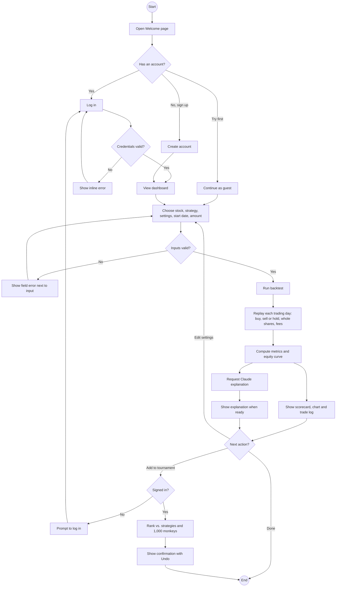
```mermaid
flowchart TD
    start((Start)) --> welcome[Open Welcome page]
    welcome --> acct{Has an account?}
    acct -- Yes --> login[Log in]
    acct -- No, sign up --> register[Create account]
    acct -- Try first --> guest[Continue as guest]
    login --> valid{Credentials valid?}
    valid -- No --> loginErr[Show inline error] --> login
    valid -- Yes --> dash[View dashboard]
    register --> dash
    guest --> config
    dash --> config[Choose stock, strategy, settings, start date, amount]
    config --> check{Inputs valid?}
    check -- No --> inputErr[Show field error next to input] --> config
    check -- Yes --> run[Run backtest]
    run --> sim[Replay each trading day: buy, sell or hold, whole shares, fees]
    sim --> metrics[Compute metrics and equity curve]
    metrics --> show[Show scorecard, chart and trade log]
    metrics --> ai[Request Claude explanation]
    ai --> explain[Show explanation when ready]
    show --> next{Next action?}
    explain --> next
    next -- Add to tournament --> isGuest{Signed in?}
    isGuest -- No --> promptLogin[Prompt to log in] --> login
    isGuest -- Yes --> tour[Rank vs. strategies and 1,000 monkeys]
    tour --> confirm[Show confirmation with Undo]
    next -- Edit settings --> config
    next -- Done --> stop((End))
    confirm --> stop
```

## Class diagram

The Python backend is object-oriented: every rule is a `Strategy` subclass, so the `Backtester` and `Tournament` treat them the same way (including the random `MonkeyStrategy`). The React frontend only calls the API and is not shown.

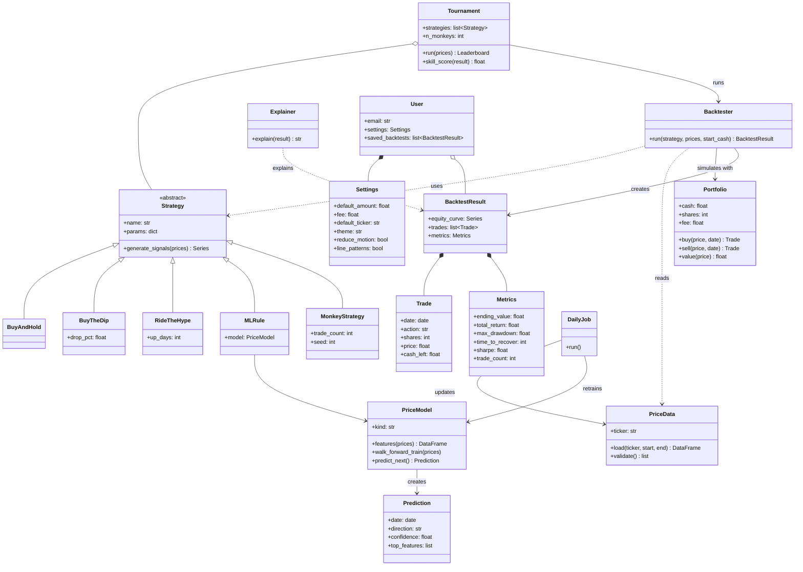
```mermaid
classDiagram
    class Strategy {
        <<abstract>>
        +name: str
        +params: dict
        +generate_signals(prices) Series
    }
    class BuyAndHold
    class BuyTheDip {
        +drop_pct: float
    }
    class RideTheHype {
        +up_days: int
    }
    class MLRule {
        +model: PriceModel
    }
    class MonkeyStrategy {
        +trade_count: int
        +seed: int
    }
    Strategy <|-- BuyAndHold
    Strategy <|-- BuyTheDip
    Strategy <|-- RideTheHype
    Strategy <|-- MLRule
    Strategy <|-- MonkeyStrategy

    class PriceData {
        +ticker: str
        +load(ticker, start, end) DataFrame
        +validate() list
    }
    class Portfolio {
        +cash: float
        +shares: int
        +fee: float
        +buy(price, date) Trade
        +sell(price, date) Trade
        +value(price) float
    }
    class Backtester {
        +run(strategy, prices, start_cash) BacktestResult
    }
    class BacktestResult {
        +equity_curve: Series
        +trades: list~Trade~
        +metrics: Metrics
    }
    class Trade {
        +date: date
        +action: str
        +shares: int
        +price: float
        +cash_left: float
    }
    class Metrics {
        +ending_value: float
        +total_return: float
        +max_drawdown: float
        +time_to_recover: int
        +sharpe: float
        +trade_count: int
    }
    class Tournament {
        +strategies: list~Strategy~
        +n_monkeys: int
        +run(prices) Leaderboard
        +skill_score(result) float
    }
    class PriceModel {
        +kind: str
        +features(prices) DataFrame
        +walk_forward_train(prices)
        +predict_next() Prediction
    }
    class Prediction {
        +date: date
        +direction: str
        +confidence: float
        +top_features: list
    }
    class Explainer {
        +explain(result) str
    }
    class DailyJob {
        +run()
    }
    class User {
        +email: str
        +settings: Settings
        +saved_backtests: list~BacktestResult~
    }
    class Settings {
        +default_amount: float
        +fee: float
        +default_ticker: str
        +theme: str
        +reduce_motion: bool
        +line_patterns: bool
    }

    Backtester ..> Strategy : uses
    Backtester ..> PriceData : reads
    Backtester --> Portfolio : simulates with
    Backtester --> BacktestResult : creates
    BacktestResult *-- Trade
    BacktestResult *-- Metrics
    Tournament o-- Strategy
    Tournament --> Backtester : runs
    MLRule --> PriceModel
    PriceModel --> Prediction : creates
    Explainer ..> BacktestResult : explains
    DailyJob --> PriceData : updates
    DailyJob --> PriceModel : retrains
    User *-- Settings
    User o-- BacktestResult
```

**Key:** hollow triangle = inherits from; filled diamond = owns (composition); hollow diamond = has (aggregation); dashed arrow = depends on.

## Sequence diagrams

One sequence diagram per functional requirement, numbered to match.

### FR1: Account access

Log in, create an account, or continue as a guest; signed-in users can log out.

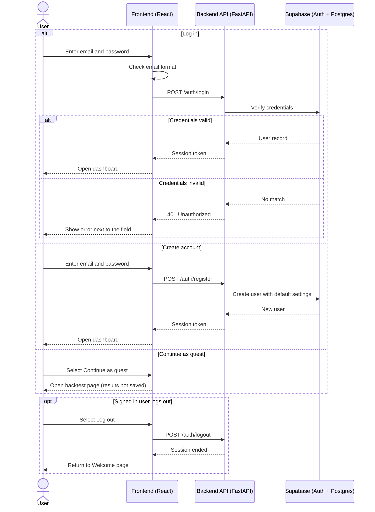
```mermaid
sequenceDiagram
    actor U as User
    participant FE as Frontend (React)
    participant API as Backend API (FastAPI)
    participant DB as Supabase (Auth + Postgres)
    alt Log in
        U->>FE: Enter email and password
        FE->>FE: Check email format
        FE->>API: POST /auth/login
        API->>DB: Verify credentials
        alt Credentials valid
            DB-->>API: User record
            API-->>FE: Session token
            FE-->>U: Open dashboard
        else Credentials invalid
            DB-->>API: No match
            API-->>FE: 401 Unauthorized
            FE-->>U: Show error next to the field
        end
    else Create account
        U->>FE: Enter email and password
        FE->>API: POST /auth/register
        API->>DB: Create user with default settings
        DB-->>API: New user
        API-->>FE: Session token
        FE-->>U: Open dashboard
    else Continue as guest
        U->>FE: Select Continue as guest
        FE-->>U: Open backtest page (results not saved)
    end
    opt Signed in user logs out
        U->>FE: Select Log out
        FE->>API: POST /auth/logout
        API-->>FE: Session ended
        FE-->>U: Return to Welcome page
    end
```

### FR2: Configure and run a backtest

Inputs are checked before anything runs; repeat requests come from the cache instead of being recomputed.

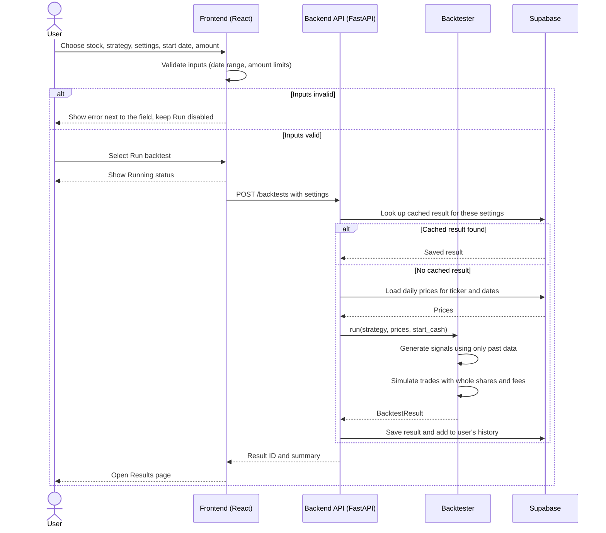
```mermaid
sequenceDiagram
    actor U as User
    participant FE as Frontend (React)
    participant API as Backend API (FastAPI)
    participant BT as Backtester
    participant DB as Supabase
    U->>FE: Choose stock, strategy, settings, start date, amount
    FE->>FE: Validate inputs (date range, amount limits)
    alt Inputs invalid
        FE-->>U: Show error next to the field, keep Run disabled
    else Inputs valid
        U->>FE: Select Run backtest
        FE-->>U: Show Running status
        FE->>API: POST /backtests with settings
        API->>DB: Look up cached result for these settings
        alt Cached result found
            DB-->>API: Saved result
        else No cached result
            API->>DB: Load daily prices for ticker and dates
            DB-->>API: Prices
            API->>BT: run(strategy, prices, start_cash)
            BT->>BT: Generate signals using only past data
            BT->>BT: Simulate trades with whole shares and fees
            BT-->>API: BacktestResult
            API->>DB: Save result and add to user's history
        end
        API-->>FE: Result ID and summary
        FE-->>U: Open Results page
    end
```

### FR3: View results

The Results page loads the saved result and the drama events for the same dates.

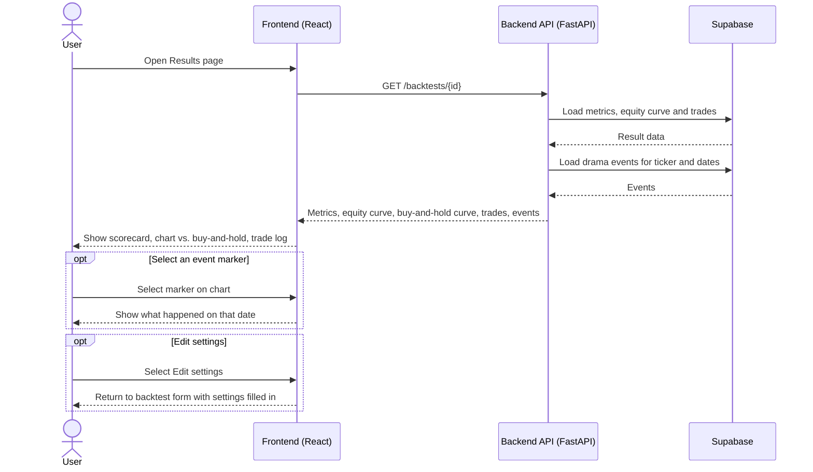
```mermaid
sequenceDiagram
    actor U as User
    participant FE as Frontend (React)
    participant API as Backend API (FastAPI)
    participant DB as Supabase
    U->>FE: Open Results page
    FE->>API: GET /backtests/{id}
    API->>DB: Load metrics, equity curve and trades
    DB-->>API: Result data
    API->>DB: Load drama events for ticker and dates
    DB-->>API: Events
    API-->>FE: Metrics, equity curve, buy-and-hold curve, trades, events
    FE-->>U: Show scorecard, chart vs. buy-and-hold, trade log
    opt Select an event marker
        U->>FE: Select marker on chart
        FE-->>U: Show what happened on that date
    end
    opt Edit settings
        U->>FE: Select Edit settings
        FE-->>U: Return to backtest form with settings filled in
    end
```

### FR4: AI explanation

The chart shows first; the explanation fills in when Claude replies, and a failure shows a clear retry instead of a blank box.

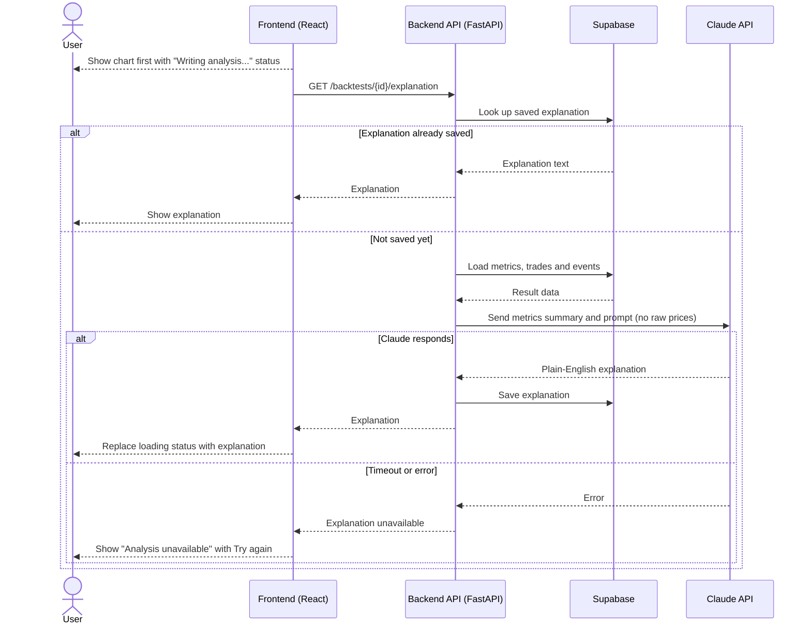
```mermaid
sequenceDiagram
    actor U as User
    participant FE as Frontend (React)
    participant API as Backend API (FastAPI)
    participant DB as Supabase
    participant C as Claude API
    FE-->>U: Show chart first with "Writing analysis..." status
    FE->>API: GET /backtests/{id}/explanation
    API->>DB: Look up saved explanation
    alt Explanation already saved
        DB-->>API: Explanation text
        API-->>FE: Explanation
        FE-->>U: Show explanation
    else Not saved yet
        API->>DB: Load metrics, trades and events
        DB-->>API: Result data
        API->>C: Send metrics summary and prompt (no raw prices)
        alt Claude responds
            C-->>API: Plain-English explanation
            API->>DB: Save explanation
            API-->>FE: Explanation
            FE-->>U: Replace loading status with explanation
        else Timeout or error
            C-->>API: Error
            API-->>FE: Explanation unavailable
            FE-->>U: Show "Analysis unavailable" with Try again
        end
    end
```

### FR5: Strategy tournament

Every strategy runs on the same prices with $1,000; the 1,000 monkeys run together in one vectorized step, each matched to the strategy's trade count.

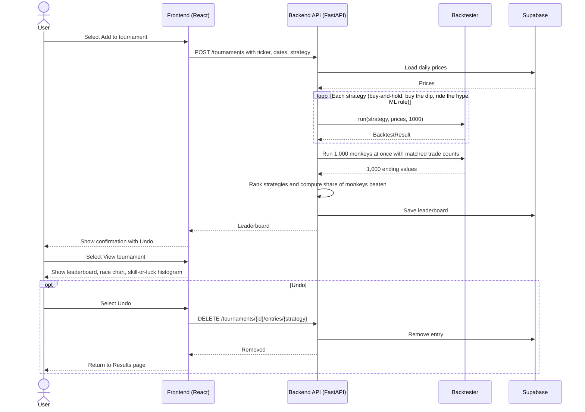
```mermaid
sequenceDiagram
    actor U as User
    participant FE as Frontend (React)
    participant API as Backend API (FastAPI)
    participant BT as Backtester
    participant DB as Supabase
    U->>FE: Select Add to tournament
    FE->>API: POST /tournaments with ticker, dates, strategy
    API->>DB: Load daily prices
    DB-->>API: Prices
    loop Each strategy (buy-and-hold, buy the dip, ride the hype, ML rule)
        API->>BT: run(strategy, prices, 1000)
        BT-->>API: BacktestResult
    end
    API->>BT: Run 1,000 monkeys at once with matched trade counts
    BT-->>API: 1,000 ending values
    API->>API: Rank strategies and compute share of monkeys beaten
    API->>DB: Save leaderboard
    API-->>FE: Leaderboard
    FE-->>U: Show confirmation with Undo
    U->>FE: Select View tournament
    FE-->>U: Show leaderboard, race chart, skill-or-luck histogram
    opt Undo
        U->>FE: Select Undo
        FE->>API: DELETE /tournaments/{id}/entries/{strategy}
        API->>DB: Remove entry
        API-->>FE: Removed
        FE-->>U: Return to Results page
    end
```

### FR6: ML prediction

The page only reads predictions the daily job already saved, so it loads instantly.

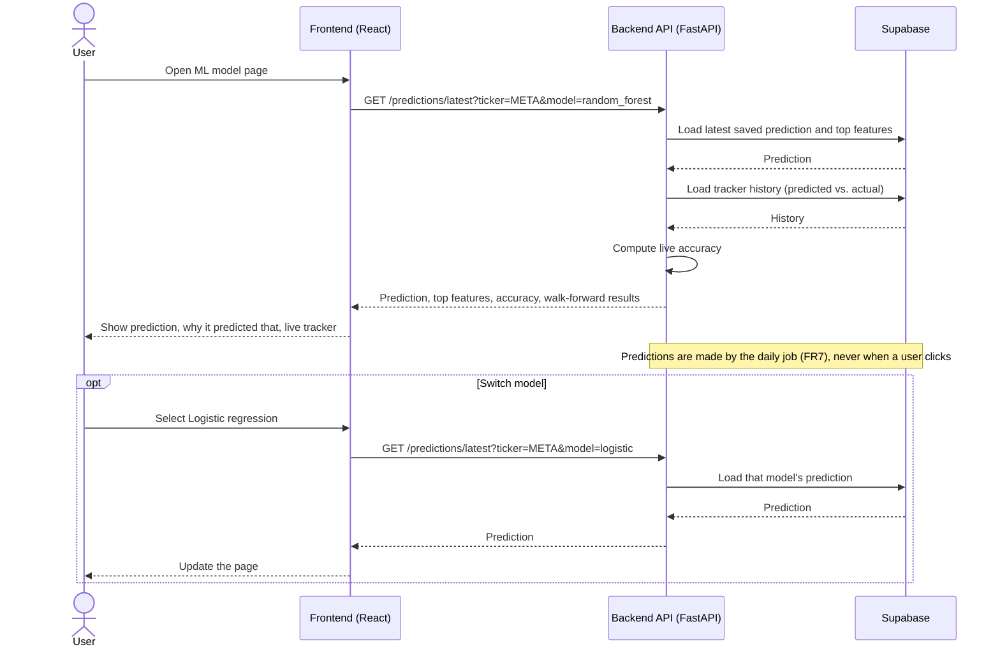
```mermaid
sequenceDiagram
    actor U as User
    participant FE as Frontend (React)
    participant API as Backend API (FastAPI)
    participant DB as Supabase
    U->>FE: Open ML model page
    FE->>API: GET /predictions/latest?ticker=META&model=random_forest
    API->>DB: Load latest saved prediction and top features
    DB-->>API: Prediction
    API->>DB: Load tracker history (predicted vs. actual)
    DB-->>API: History
    API->>API: Compute live accuracy
    API-->>FE: Prediction, top features, accuracy, walk-forward results
    FE-->>U: Show prediction, why it predicted that, live tracker
    Note over API,DB: Predictions are made by the daily job (FR7), never when a user clicks
    opt Switch model
        U->>FE: Select Logistic regression
        FE->>API: GET /predictions/latest?ticker=META&model=logistic
        API->>DB: Load that model's prediction
        DB-->>API: Prediction
        API-->>FE: Prediction
        FE-->>U: Update the page
    end
```

### FR7: Daily data pipeline

No user is involved. Bad or missing data never overwrites good data, and the job's status feeds the dashboard (FR8).

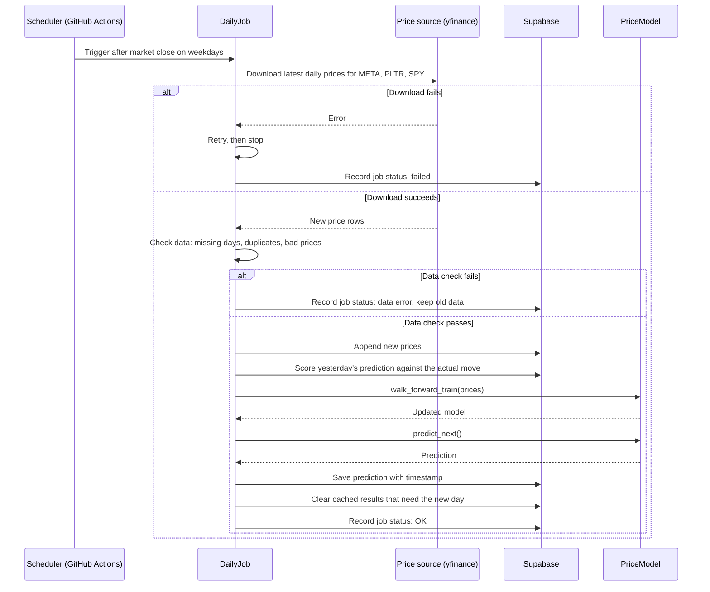
```mermaid
sequenceDiagram
    participant S as Scheduler (GitHub Actions)
    participant J as DailyJob
    participant Y as Price source (yfinance)
    participant DB as Supabase
    participant M as PriceModel
    S->>J: Trigger after market close on weekdays
    J->>Y: Download latest daily prices for META, PLTR, SPY
    alt Download fails
        Y-->>J: Error
        J->>J: Retry, then stop
        J->>DB: Record job status: failed
    else Download succeeds
        Y-->>J: New price rows
        J->>J: Check data: missing days, duplicates, bad prices
        alt Data check fails
            J->>DB: Record job status: data error, keep old data
        else Data check passes
            J->>DB: Append new prices
            J->>DB: Score yesterday's prediction against the actual move
            J->>M: walk_forward_train(prices)
            M-->>J: Updated model
            J->>M: predict_next()
            M-->>J: Prediction
            J->>DB: Save prediction with timestamp
            J->>DB: Clear cached results that need the new day
            J->>DB: Record job status: OK
        end
    end
```

### FR8: Dashboard and rerun

The three dashboard requests run in parallel so the page loads quickly; a rerun reuses saved settings.

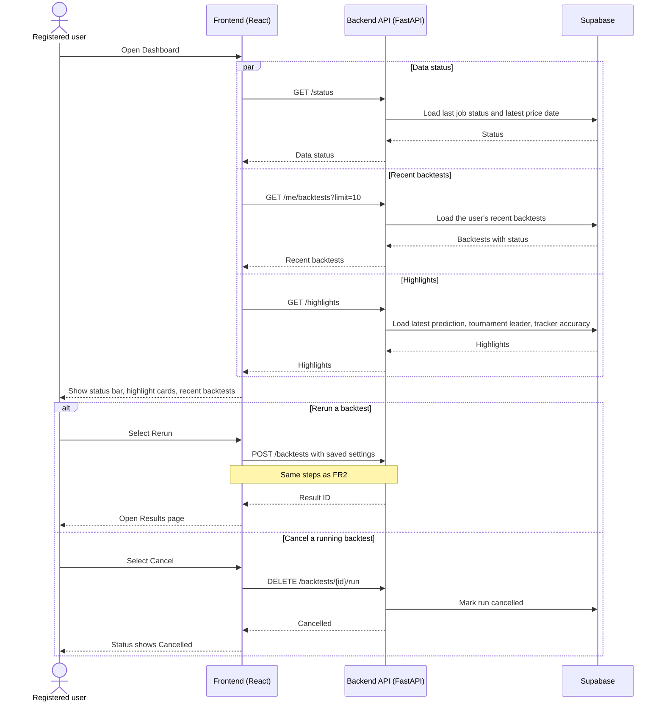
```mermaid
sequenceDiagram
    actor U as Registered user
    participant FE as Frontend (React)
    participant API as Backend API (FastAPI)
    participant DB as Supabase
    U->>FE: Open Dashboard
    par Data status
        FE->>API: GET /status
        API->>DB: Load last job status and latest price date
        DB-->>API: Status
        API-->>FE: Data status
    and Recent backtests
        FE->>API: GET /me/backtests?limit=10
        API->>DB: Load the user's recent backtests
        DB-->>API: Backtests with status
        API-->>FE: Recent backtests
    and Highlights
        FE->>API: GET /highlights
        API->>DB: Load latest prediction, tournament leader, tracker accuracy
        DB-->>API: Highlights
        API-->>FE: Highlights
    end
    FE-->>U: Show status bar, highlight cards, recent backtests
    alt Rerun a backtest
        U->>FE: Select Rerun
        FE->>API: POST /backtests with saved settings
        Note over FE,API: Same steps as FR2
        API-->>FE: Result ID
        FE-->>U: Open Results page
    else Cancel a running backtest
        U->>FE: Select Cancel
        FE->>API: DELETE /backtests/{id}/run
        API->>DB: Mark run cancelled
        API-->>FE: Cancelled
        FE-->>U: Status shows Cancelled
    end
```

### FR9: Settings

Changes are flagged until saved, and deleting the account needs a typed confirmation.

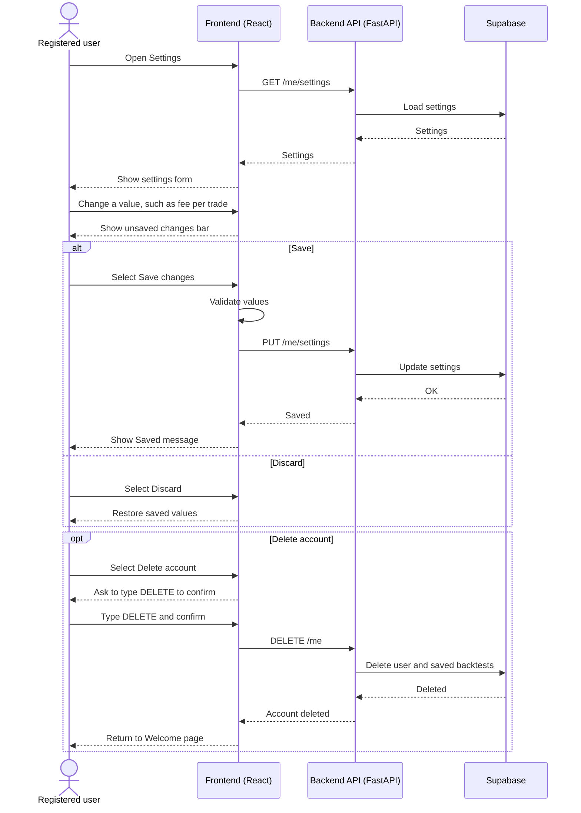
```mermaid
sequenceDiagram
    actor U as Registered user
    participant FE as Frontend (React)
    participant API as Backend API (FastAPI)
    participant DB as Supabase
    U->>FE: Open Settings
    FE->>API: GET /me/settings
    API->>DB: Load settings
    DB-->>API: Settings
    API-->>FE: Settings
    FE-->>U: Show settings form
    U->>FE: Change a value, such as fee per trade
    FE-->>U: Show unsaved changes bar
    alt Save
        U->>FE: Select Save changes
        FE->>FE: Validate values
        FE->>API: PUT /me/settings
        API->>DB: Update settings
        DB-->>API: OK
        API-->>FE: Saved
        FE-->>U: Show Saved message
    else Discard
        U->>FE: Select Discard
        FE-->>U: Restore saved values
    end
    opt Delete account
        U->>FE: Select Delete account
        FE-->>U: Ask to type DELETE to confirm
        U->>FE: Type DELETE and confirm
        FE->>API: DELETE /me
        API->>DB: Delete user and saved backtests
        DB-->>API: Deleted
        API-->>FE: Account deleted
        FE-->>U: Return to Welcome page
    end
```

## Use case diagram

Four actors use nine use cases, one per functional requirement. A registered user can do everything a guest can, plus save work, join tournaments, use the dashboard, and change settings.

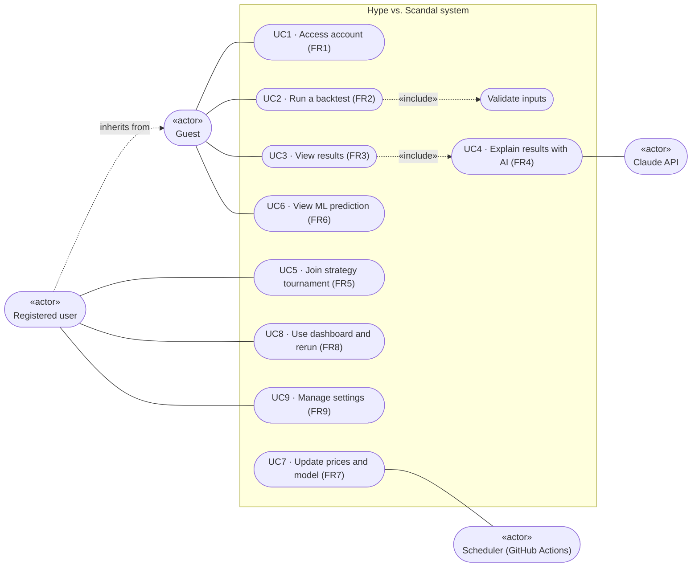
```mermaid
flowchart LR
    guest(["«actor»<br/>Guest"])
    user(["«actor»<br/>Registered user"])
    user -. "inherits from" .-> guest
    subgraph sys ["Hype vs. Scandal system"]
        uc1(["UC1 · Access account (FR1)"])
        uc2(["UC2 · Run a backtest (FR2)"])
        uc3(["UC3 · View results (FR3)"])
        uc6(["UC6 · View ML prediction (FR6)"])
        uc5(["UC5 · Join strategy tournament (FR5)"])
        uc8(["UC8 · Use dashboard and rerun (FR8)"])
        uc9(["UC9 · Manage settings (FR9)"])
        uc7(["UC7 · Update prices and model (FR7)"])
        ucv(["Validate inputs"])
        uc4(["UC4 · Explain results with AI (FR4)"])
    end
    claude(["«actor»<br/>Claude API"])
    sched(["«actor»<br/>Scheduler (GitHub Actions)"])
    guest --- uc1
    guest --- uc2
    guest --- uc3
    guest --- uc6
    user --- uc5
    user --- uc8
    user --- uc9
    uc2 -. "«include»" .-> ucv
    uc3 -. "«include»" .-> uc4
    uc4 --- claude
    uc7 --- sched
```

| Actor | Type | Use cases |
| --- | --- | --- |
| Guest | Primary, human | UC1, UC2, UC3, UC6 |
| Registered user | Primary, human (inherits Guest) | All Guest use cases, plus UC5, UC8, UC9 |
| Claude API | Secondary, external system | UC4 |
| Scheduler (GitHub Actions) | Primary, system | UC7 |

## User interface wireframes

Ten screens cover every functional requirement. Numbers in brackets such as `[$ X]` are placeholders until real results exist, and chart lines are sketches, not data.

| Screen | Requirements shown |
| --- | --- |
| 0. Style guide | All (colors, type, buttons, icons, feedback states) |
| 1. Welcome | FR1 |
| 2. Log in | FR1 |
| 3. Dashboard | FR7 (data status), FR8 |
| 4. Run a backtest | FR2 |
| 5. Results | FR3, FR4 |
| 6. Strategy tournament | FR5 |
| 7. ML model | FR6 |
| 8. Settings | FR9 |
| 9. Confirmation | FR5 |

### 0. Style guide

Colors with contrast ratios, the two fonts, button and field states, icons, and chart marks that work without color.

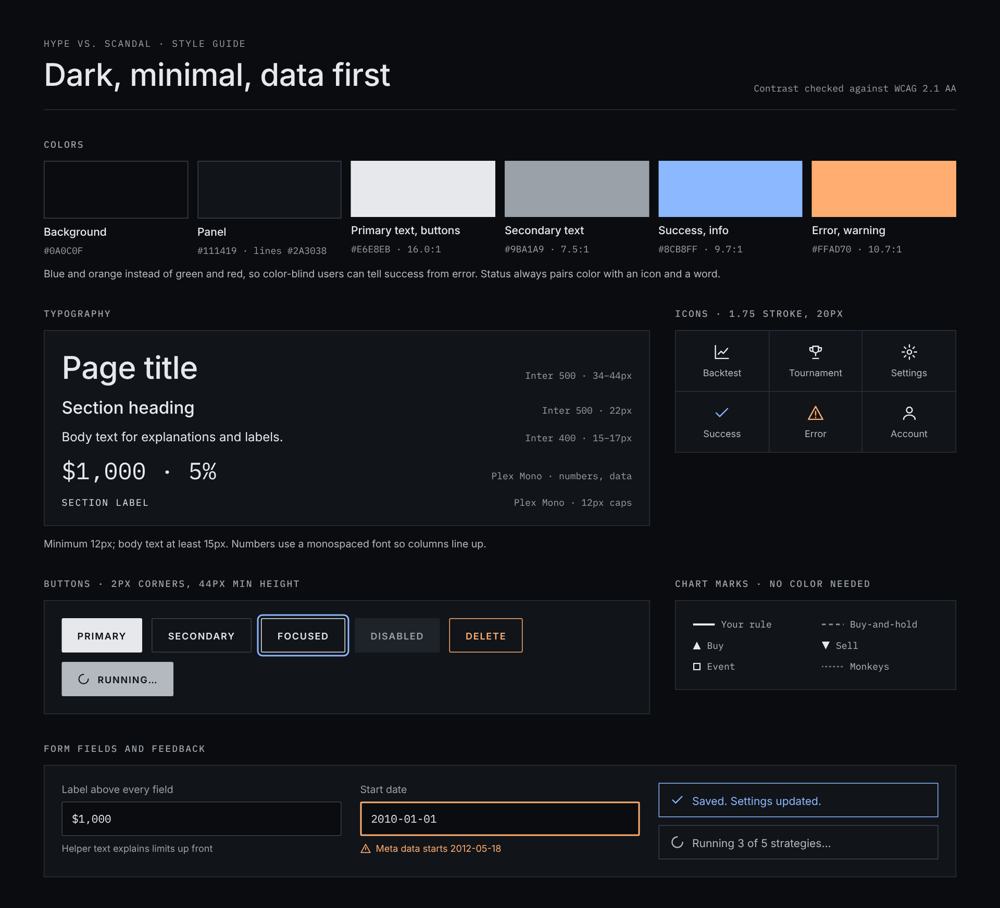

### 1. Welcome

One sentence on what the app does, one main action, and a guest option.

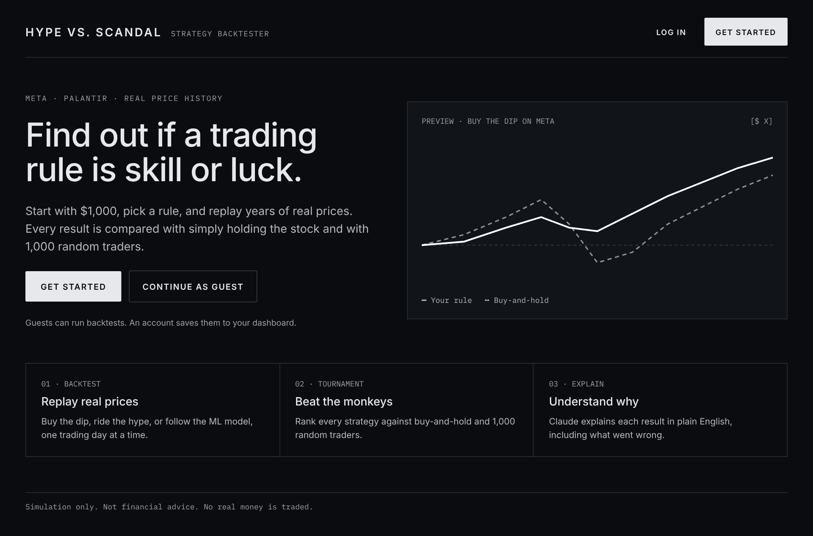

### 2. Log in

Log in or create an account, with an inline error example and a guest option.

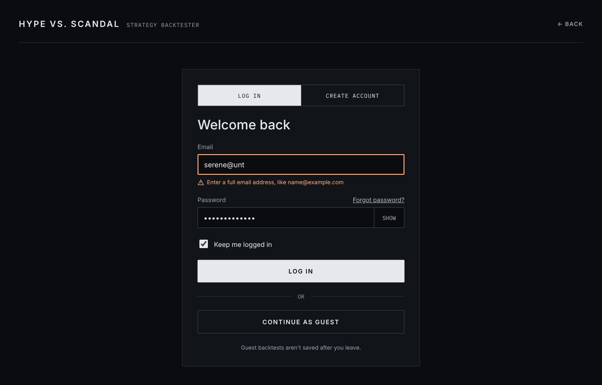

### 3. Dashboard

Data status from the daily job, today's highlights, and recent backtests with Rerun, Cancel, and Fix and retry.

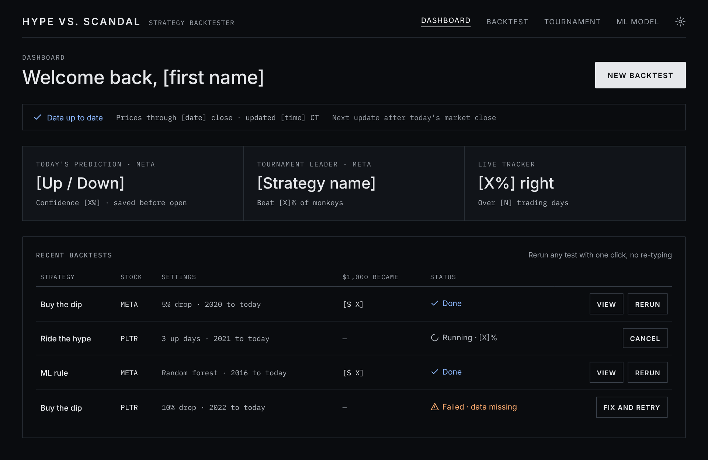

### 4. Run a backtest

Stock, strategy, drop threshold, start date with its earliest allowed value, and starting amount.

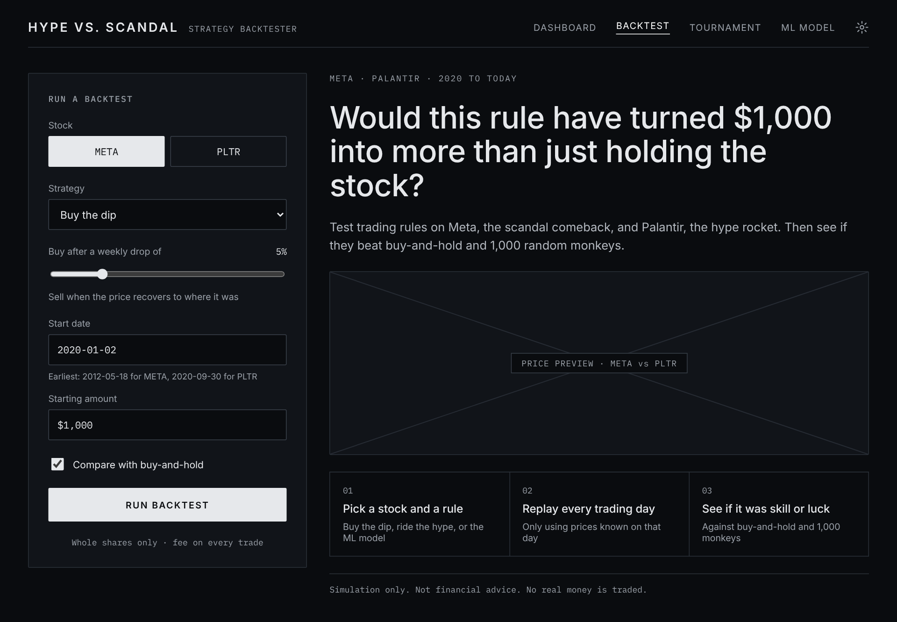

### 5. Results

Scorecard, portfolio value against buy-and-hold, Claude's analysis while it loads, and the trade log.

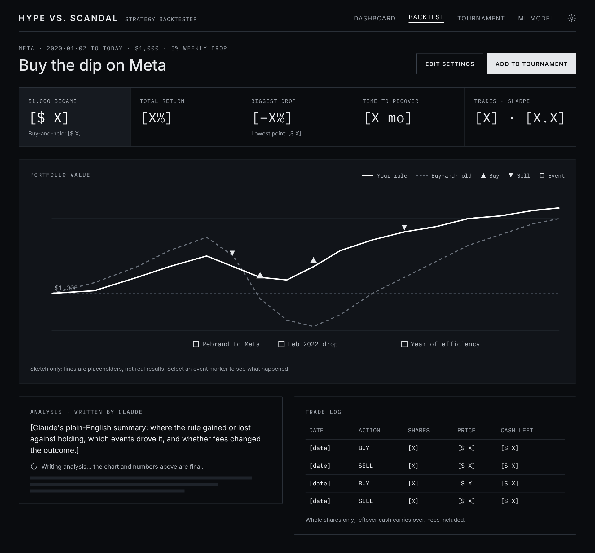

### 6. Strategy tournament

Leaderboard, race chart, and where the strategy lands among 1,000 random monkeys.

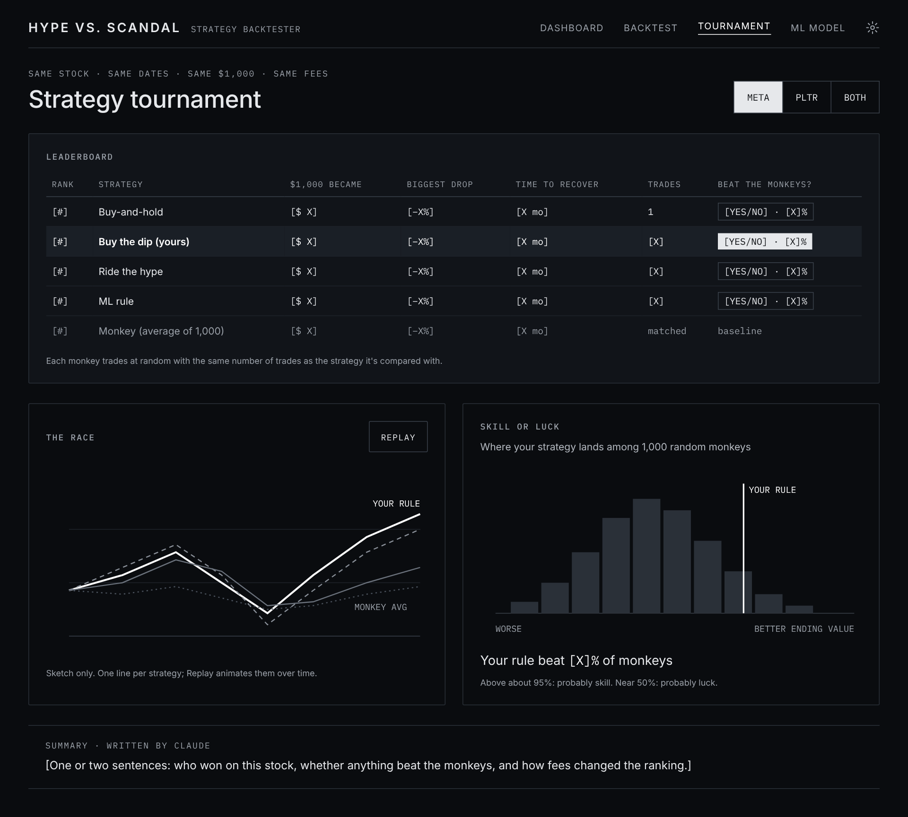

### 7. ML model

Today's prediction, the live tracker, the features behind the call, and walk-forward testing.

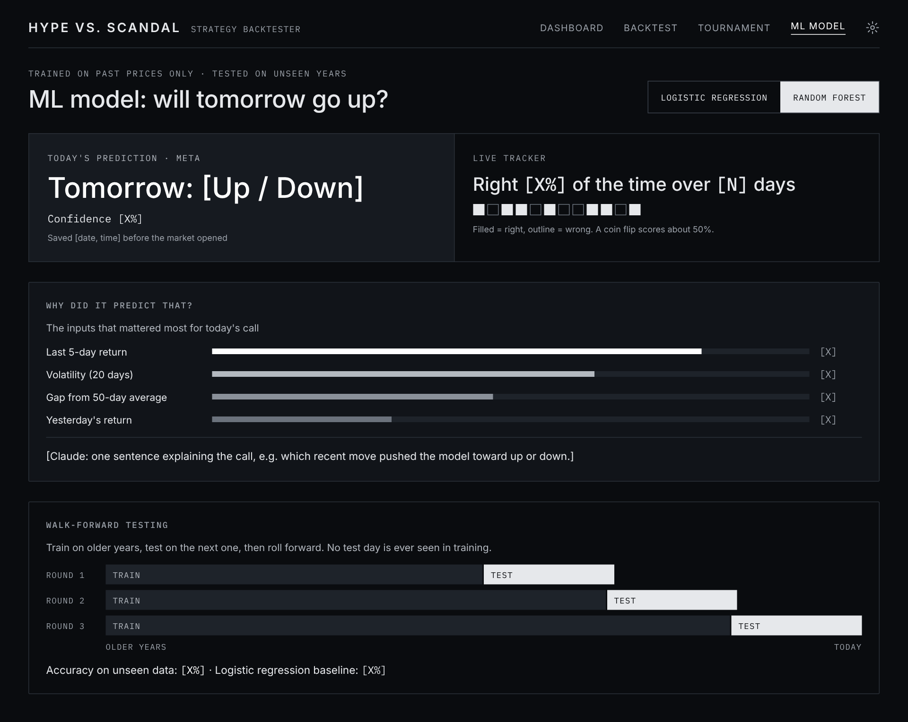

### 8. Settings

Backtest defaults, theme and accessibility options, notifications, account, and the unsaved-changes bar.

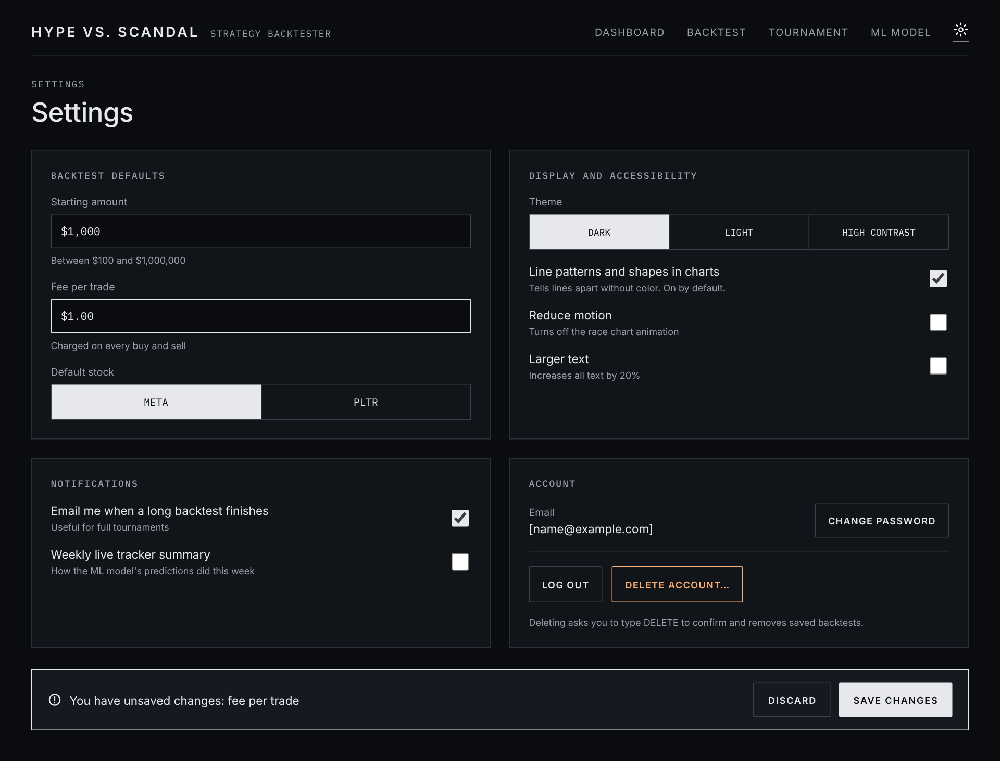

### 9. Confirmation

Success message with a summary, next steps, and Undo.

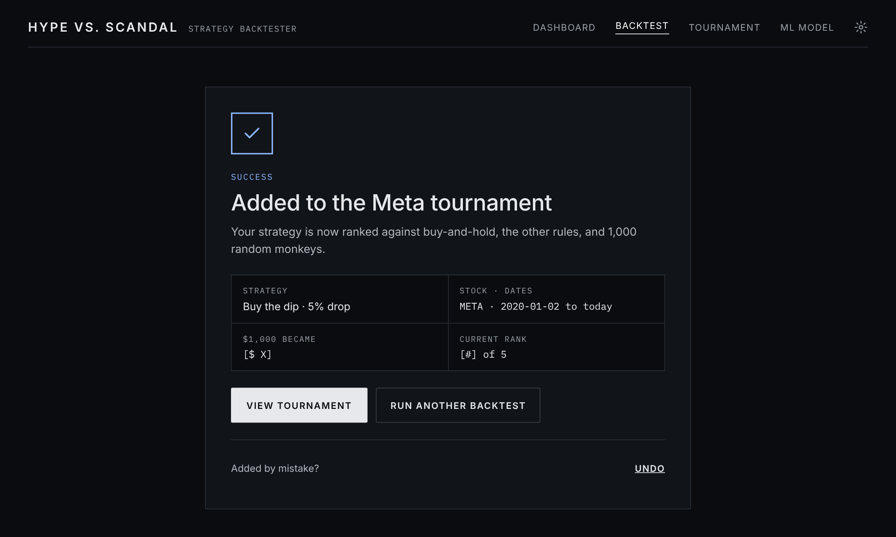
